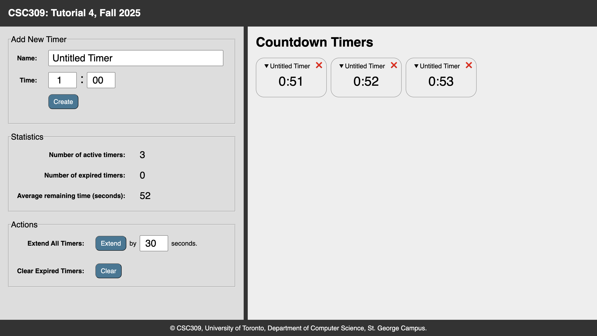
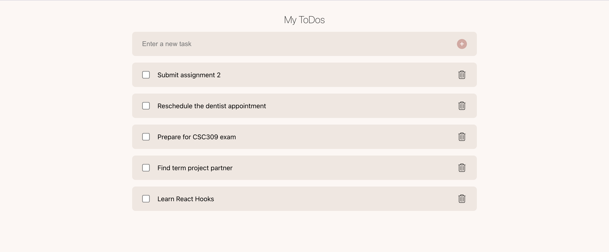
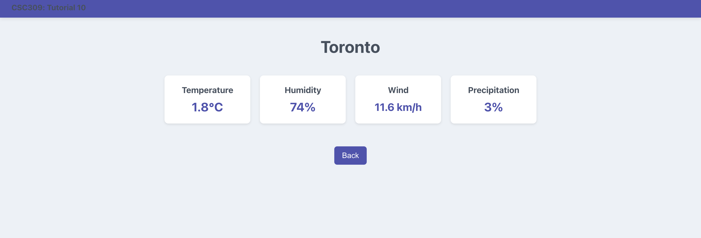
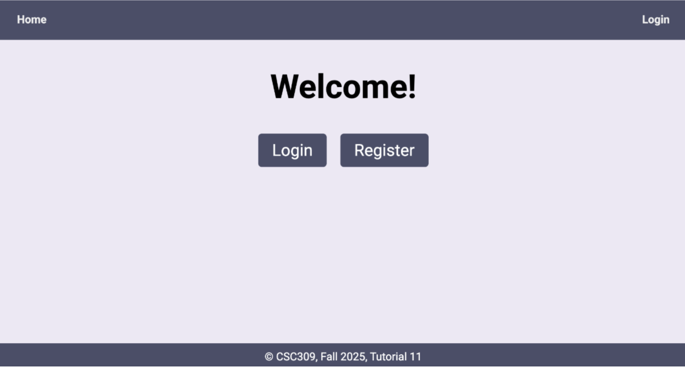
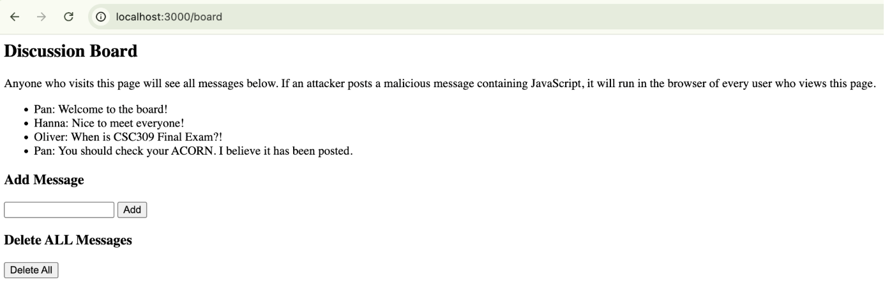

# CSC309-labs

# Assignments

## Assignment 1 - Static Web Page
The objective of this assignment is to familiarize yourselves with the basics of HTML and CSS. You will learn how to build a basic static website using HTML and CSS by writing code to structure the content and style the appearance of their website. You will also learn how to use various HTML tags and CSS properties to add different elements and formatting to their website. Through this assignment, you will gain a foundational understanding of how to build and design web pages using these essential web development technologies.

For this assignment, you will build a personal website from a prototype such that the resulting web pages match the prototype, in addition to the other requirements listed in the Requirements section.

## Assignment 2 - REST API Backend for Loyalty Program
In this assignment, you will build a REST API backend for a loyalty program using Express.js and Prisma. This loyalty program will enable users to accumulate points for purchases and redeem them for free items, similar to PC Optimum. The objective is to develop the backend infrastructure for the loyalty program, which will serve as the foundation for your term project.

Later in the term project, you and your teammates will add new features into the backend and build the frontend and deploy the web application.

# Labs

## Lab 2 - HTML
In this exercise, you'll create a basic HTML webpage structure using various HTML elements and semantic tags. The final result should resemble the page shown below. Please note that this lab focuses on HTML, so there's no need to style the page using CSS.

## Lab 3 - CSS
In this tutorial, your goal is to design and develop a personal portfolio using HTML and CSS as shown below.

The design includes two pages: "About" and "Contact." The HTML files for these pages, about.html and contact.html, are provided. Your job is to style these pages by completing the style.css file.

|  |  |
|-------------------|-------------------|

## Lab 4 - Javascript
In this tutorial, you will work on implementing the functionality for managing countdown timers on a webpage. The tasks adding new timers, updating statistics about them, and implementing actions that operate on a list of timers. Below is a video working with the completed version of the tutorial exercise:

## Lab 5 - ExpressJS Backend
For this tutorial, we will be creating the backend of a TODO Note List application. You will set up a Node.js/Express.js project and create some simple HTTP endpoints to achieve basic functionality. You will also be interacting with your application through a REST client like Postman.

## Lab 6 - Prisma and Auth
In this tutorial, you will enhance your server by implementing the following features, building on what you accomplished in Tutorial 5:

Define Models: Create the User and Note models in schema.prisma to structure your database.
Seed Database: Add mock data to populate the database.
Implement Authentication: Develop a basic authentication middleware to secure certain endpoints, requiring users to provide credentials.
Enhance Endpoints: Update existing endpoints and add new ones to create a fully functional todo app where users can manage their notes.

## Lab 7 - Backend Development
The purpose of this tutorial is to teach you how to properly organize your code base and take advantage of various development tools. The goal is to help improve your efficiency while coding, and your ability to build robust web applications.

## Lab 8 - Infinite Scrolling
In this tutorial, you will write JavaScript code to implement infinite scrolling. 

## Lab 9 - React Basics
In this tutorial, you will build a simple TODO list application using React. Along the way, you'll learn the fundamentals of setting up a React project, organizing files, and structuring components effectively (which helps your project development).

## Lab 10 - React Router
In this tutorial, you'll create a weather application using React, fetching data from various API endpoints. The application will feature two pages: a Home page displaying multiple cities and their temperatures, and a Detail page providing detailed weather information for a specific city.

|  |  |
|-------------------|-------------------|

## Lab 11 - PaaS
In this lab, you will build a simple React application with a backend in Express.js that allows users to register and log in.

This tutorial will guide you through the steps of creating a basic full-stack application with:

React frontend: A simple user interface for registration and login.
Express.js backend: To handle user registration, login, and authentication.
You will also deploy both the frontend and backend to make your application publicly accessible with minimal setup.

## Lab 12 - XSS, CSRF, and Secure Cookies
In this tutorial, you will explore common web vulnerabilities by working with a deliberately insecure Express.js application.

The application is a discussion board. Note that it intentionally contains several bad practices for the sake of simplicity. You’ll likely notice issues such as tight coupling between the frontend and backend, but these are not the focus of this tutorial.

What we will be focusing on for this tutorial is the security vulnerabilities.

