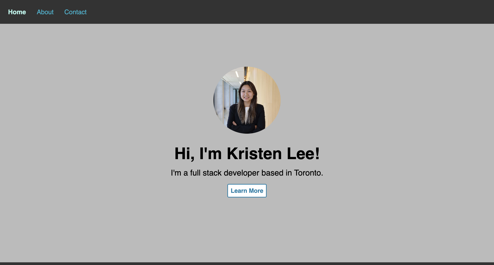
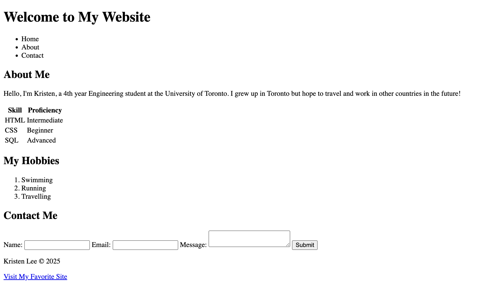
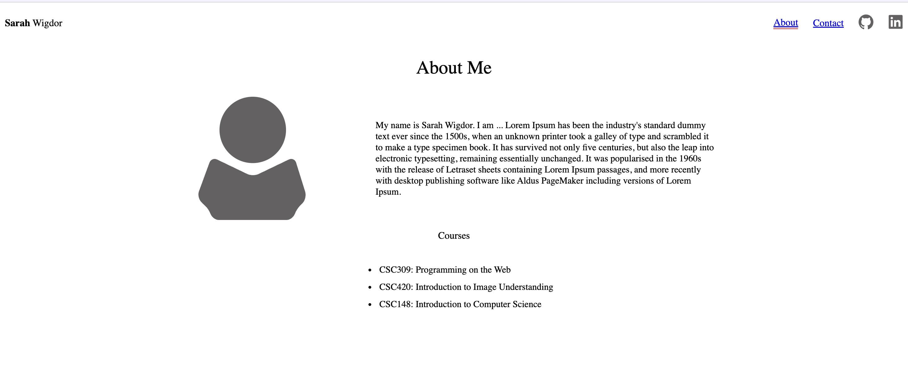
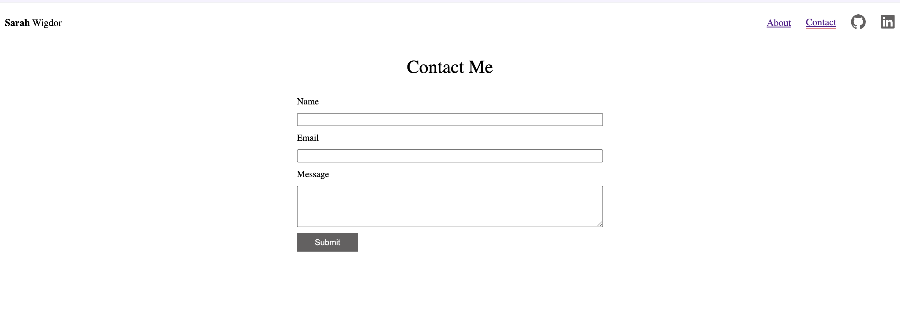
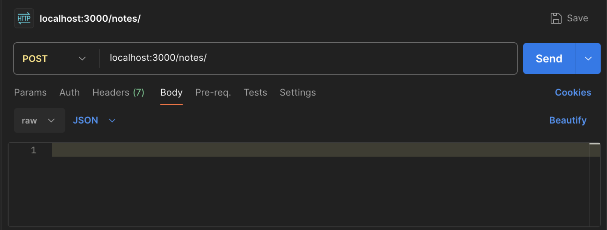
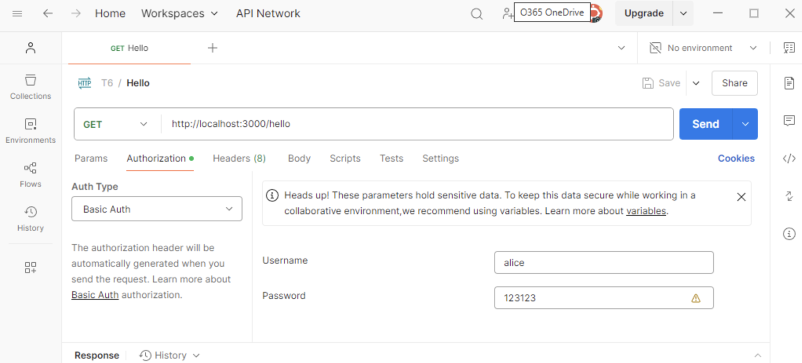
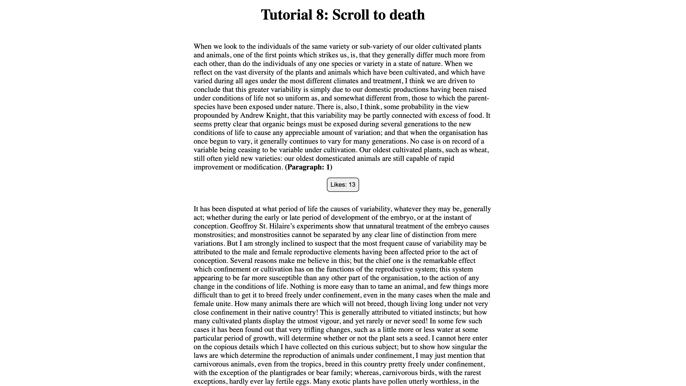
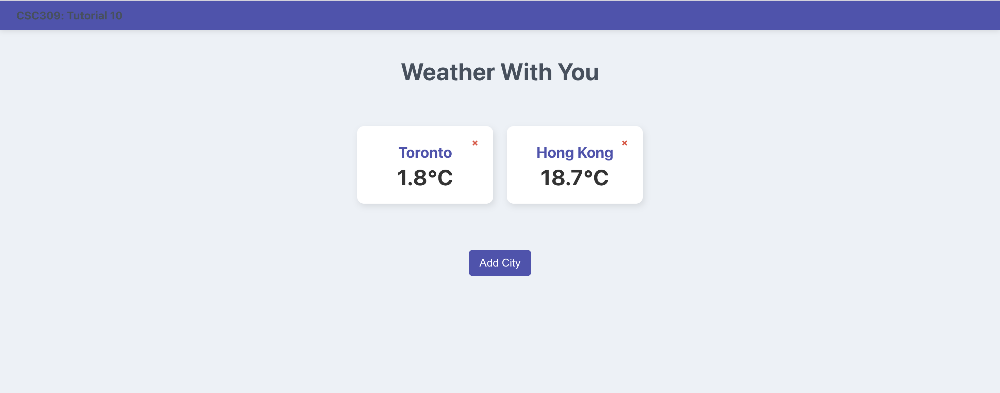

# CSC309-labs

## Assignment 1 - Static Web Page

## Assignment 2 - REST API Backend for Loyalty Program

## Lab 2 - HTML

## Lab 3 - CSS
|  |  |
|-------------------|-------------------|

## Lab 4 - Javascript

## Lab 5 - ExpressJS Backend

## Lab 6 - Prisma and Auth

## Lab 7 - Backend Development

## Lab 8 - Infinite Scrolling

## Lab 9 - React Basics

## Lab 10 - React Router
|  |  |
|-------------------|-------------------|

## Lab 11 - PaaS

## Lab 12 - XSS, CSRF, and Secure Cookies
